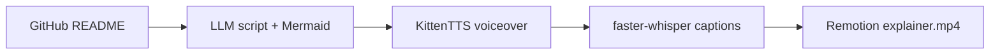
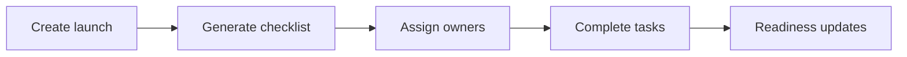

<div align="center">


<!-- ⬇️ Custom animated mascot: bobs, blinks, waves, and types live code -->


<a href="https://github.com/kh-bikash">
  
</a>

<br/>

[](https://github.com/kh-bikash)
[](https://www.linkedin.com/in/bikash-kh-5544ba298/)
[](mailto:khbikash17@gmail.com)
[](https://github.com/kh-bikash/portfolio)

<br/>


</div>

---

## `> whoami`

```typescript
const bikash = {
  role: "AI Engineer + Full-Stack Builder",
  location: "Manipur, India 🇮🇳",

  builds: [
    "AI product pipelines",
    "interactive learning systems",
    "3D visual interfaces",
    "persistent full-stack applications",
  ],

  stack: ["Python", "TypeScript", "React", "Next.js", "FastAPI", "Three.js"],
  principle: "If it is featured here, you can inspect the real code.",
};
```

> I like projects that do something visible: **generate, explain, simulate, render, measure, or automate.**

---

## `> select_experience` — click a card to open it

<details open>
<summary><b>🎙️ &nbsp;Turn a GitHub README into a narrated video</b></summary>
<br/>

### 📻 [README Radio](https://github.com/kh-bikash/ReadmeRadio)

A working monorepo that turns a public repository README into a narrated, captioned explainer video.




[](https://github.com/kh-bikash/ReadmeRadio)
[](https://codespaces.new/kh-bikash/ReadmeRadio?quickstart=1)

</details>

<details>
<summary><b>🧠 &nbsp;Operate AI concepts inside a visual learning OS</b></summary>
<br/>

### 🌌 [AIVerse](https://github.com/kh-bikash/Aiverse)

Interactive AI labs built with React, Three.js, D3, Monaco, XYFlow, and Hugging Face Transformers.

|  | Lab |
|---|---|
| 🕸️ | Explore neural networks through live visualizations |
| 🧭 | Navigate transformer and attention concepts in 3D |
| 👁️ | Experiment with computer vision and agent workflows |
| 🖥️ | Use an OS-style workspace instead of passive lessons |


[](https://github.com/kh-bikash/Aiverse)
[](https://codespaces.new/kh-bikash/Aiverse?quickstart=1)

</details>

<details>
<summary><b>🚀 &nbsp;Run a product launch from plan to readiness</b></summary>
<br/>

### 🛰️ [LaunchPad](https://github.com/kh-bikash/launchpad)

A persistent launch-operations workspace with real ownership, due dates, generated checklists, completion state, and readiness calculated from saved Cloudflare D1 data.




[](https://github.com/kh-bikash/launchpad#watch-the-real-product-walkthrough)
[](https://codespaces.new/kh-bikash/launchpad?quickstart=1)

</details>

<details>
<summary><b>🎓 &nbsp;Explore a deployed multi-role university ERP</b></summary>
<br/>

### 🏛️ [Nova University ERP](https://github.com/kh-bikash/nova-university-erp)

A deployed Next.js university workspace with student, faculty, and administration flows.

- Attendance, grading, fees, hostel, transport, and library modules
- PostgreSQL persistence and Redis-backed background work
- JWT authentication and role-aware dashboards
- Public Vercel deployment


[](https://nova-university-erp.vercel.app/)
[](https://github.com/kh-bikash/nova-university-erp)

</details>

---

## `> repository_signal --live`

These update automatically from the real repositories:

| Project | Last commit | Language | Size | Issues |
|---|---|---|---|---|
| [README Radio](https://github.com/kh-bikash/ReadmeRadio) |  |  |  |  |
| [AIVerse](https://github.com/kh-bikash/Aiverse) |  |  |  |  |
| [LaunchPad](https://github.com/kh-bikash/launchpad) |  |  |  |  |
| [Nova ERP](https://github.com/kh-bikash/nova-university-erp) |  |  |  |  |

<details>
<summary><b>🧪 &nbsp;Open the experiment vault</b></summary>
<br/>

| Project | What it does |
|---|---|
| [MedVision](https://github.com/kh-bikash/medvision) | FastAPI computer-vision pipeline, generated 3D meshes, Three.js viewer, and webcam controls |
| [Cosmic Comic Studio](https://github.com/kh-bikash/comic-studio) | Concurrent AI comic-panel generation, multiple art styles, browser persistence, and PDF export |
| [AlgoGenesis 3D](https://github.com/kh-bikash/algogenesis-3d) | Interactive 3D algorithm playback with a code editor and AI explanations |
| [Sign Language Detector](https://github.com/kh-bikash/sign_lang_detector) | Webcam capture and real-time CNN gesture inference using TensorFlow and OpenCV |

</details>

---

## `> stack --compact`

<div align="center">


</div>

---

## `> github_telemetry`

<div align="center">


<br/>


<br/>


<br/>

<!-- Powered by the snake workflow in .github/workflows/snake.yml -->
<picture>
  <source
    media="(prefers-color-scheme: dark)"
    srcset="https://raw.githubusercontent.com/kh-bikash/kh-bikash/output/github-contribution-grid-snake-dark.svg"
  />
  <source
    media="(prefers-color-scheme: light)"
    srcset="https://raw.githubusercontent.com/kh-bikash/kh-bikash/output/github-contribution-grid-snake.svg"
  />
  
</picture>

</div>

---

## `> connect --interactive`

Pick an action:

<details>
<summary><b>💡 &nbsp;I have a product idea</b></summary>
<br/>

[](https://github.com/kh-bikash/kh-bikash/issues/new?title=Build%20idea%3A%20&body=%23%23%20The%20idea%0A%0A%23%23%20Who%20it%20helps%0A%0A%23%23%20What%20a%20useful%20first%20version%20does%0A)

</details>

<details>
<summary><b>🤝 &nbsp;I want to collaborate</b></summary>
<br/>

[](mailto:khbikash17@gmail.com?subject=Let%27s%20build%20something)
[](https://www.linkedin.com/in/bikash-kh-5544ba298/)

</details>

<details>
<summary><b>🐛 &nbsp;I found a bug in one of your projects</b></summary>
<br/>

[](https://github.com/kh-bikash/kh-bikash/issues/new?title=Bug%3A%20&body=%23%23%20Repository%0A%0A%23%23%20What%20happened%0A%0A%23%23%20What%20you%20expected%0A%0A%23%23%20Steps%20to%20reproduce%0A1.%20%0A2.%20%0A)

</details>

<div align="center">

<br/>

```text
BUILD IN PUBLIC  //  TEST THE REAL FLOW  //  SHIP WHAT WORKS
```

<sub>Built in Manipur, India 🇮🇳 · open to AI engineering, product collaboration, and open source.</sub>

</div>


