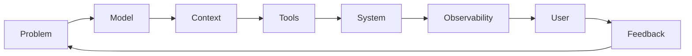

````html
<!--
╔══════════════════════════════════════════════════════════════╗
║                                                              ║
║      KHUNDRAKPAM BIKASH MEITEI · GITHUB PROFILE             ║
║                                                              ║
║      Built with restraint. Shipped with intent.              ║
║                                                              ║
╚══════════════════════════════════════════════════════════════╝
-->

<div align="center">


<br/>


<br/><br/>

<a href="mailto:khbikash17@gmail.com">
  
</a>
&nbsp;
<a href="https://www.linkedin.com/in/bikash-kh-5544ba298/">
  
</a>
&nbsp;
<a href="https://github.com/kh-bikash">
  
</a>

<br/><br/>


</div>

<br/>

---

<br/>

## `01 / identity`

```typescript
const bikash = {
  role: "AI Engineer",

  building: [
    "agentic AI systems",
    "RAG + retrieval pipelines",
    "ML-backed products",
    "backend infrastructure",
    "interactive interfaces"
  ],

  principles: [
    "build the real flow",
    "inspect what fails",
    "measure before claiming",
    "ship something people can use"
  ],

  status: "building."
};
````

<br/>

<div align="center">


</div>

<br/>

---

<br/>

## `02 / what I care about`

<div align="center">

<table>
<tr>

<td width="25%" align="center">
<h3>Agents</h3>
<sub>
reasoning<br/>
tool calling<br/>
orchestration
</sub>
</td>

<td width="25%" align="center">
<h3>Retrieval</h3>
<sub>
RAG<br/>
embeddings<br/>
evaluation
</sub>
</td>

<td width="25%" align="center">
<h3>Systems</h3>
<sub>
APIs<br/>
workers<br/>
observability
</sub>
</td>

<td width="25%" align="center">
<h3>Products</h3>
<sub>
interfaces<br/>
real users<br/>
real state
</sub>
</td>

</tr>
</table>

</div>

<br/>

---

<br/>

# `03 / selected work`

<div align="center">


</div>

<br/>

<table>

<tr>

<td width="50%" valign="top">

### README Radio

<sub>Repository → narrated technical explainer video</sub>

<br/><br/>

Give it a public GitHub repository and it turns the project into a narrated `.mp4` explainer.

```text
repo
 │
 ├─ read source
 ├─ understand project
 ├─ write narrative
 ├─ generate narration
 ├─ align captions
 └─ render video
```

<sub>
Node.js · Python · Remotion · faster-whisper
</sub>

<br/><br/>

<a href="https://github.com/kh-bikash/ReadmeRadio">

</a>

<a href="https://codespaces.new/kh-bikash/ReadmeRadio?quickstart=1">

</a>

<br/><br/>


</td>

<td width="50%" valign="top">

### AIVerse

<sub>An interactive workspace for understanding AI systems</sub>

<br/><br/>

Instead of only reading about transformers, neural networks and vision, AIVerse turns those ideas into things you can explore visually.

```text
concept
   ↓
visualize
   ↓
interact
   ↓
experiment
   ↓
understand
```

<sub>
React · Three.js · D3 · Transformers
</sub>

<br/><br/>

<a href="https://github.com/kh-bikash/Aiverse">

</a>

<a href="https://codespaces.new/kh-bikash/Aiverse?quickstart=1">

</a>

<br/><br/>


</td>

</tr>

<tr>

<td width="50%" valign="top">

### LaunchPad

<sub>Launch operations backed by actual persisted state</sub>

<br/><br/>

A launch workspace built around real ownership, due dates and readiness instead of static demo dashboards.

```text
tasks + owners + deadlines
           ↓
       saved state
           ↓
  computed readiness
           ↓
       decisions
```

<sub>
Next.js · Cloudflare D1 · Drizzle
</sub>

<br/><br/>

<a href="https://github.com/kh-bikash/launchpad">

</a>

<a href="https://github.com/kh-bikash/launchpad#watch-the-real-product-walkthrough">

</a>

<br/><br/>


</td>

<td width="50%" valign="top">

### Nova University ERP

<sub>One deployed workspace for university operations</sub>

<br/><br/>

Student, faculty and administration workflows brought together into a single system.

```text
students ─────┐
faculty  ─────┤
attendance ───┤
grading ──────┼── university ERP
fees ─────────┤
hostel ───────┤
library ──────┘
```

<sub>
Next.js · PostgreSQL · Redis · JWT
</sub>

<br/><br/>

<a href="https://github.com/kh-bikash/nova-university-erp">

</a>

<a href="https://nova-university-erp.vercel.app/">

</a>

<br/><br/>


</td>

</tr>

</table>

<br/>

---

<br/>

## `04 / experiments`

<table>

<tr>
<td width="30%">
<a href="https://github.com/kh-bikash/medvision"><b>MedVision ↗</b></a>
</td>
<td>
Vision pipeline that moves from inference toward browser-viewable 3D output.
</td>
</tr>

<tr>
<td>
<a href="https://github.com/kh-bikash/comic-studio"><b>Cosmic Comic Studio ↗</b></a>
</td>
<td>
Concurrent AI comic generation with style controls and PDF export.
</td>
</tr>

<tr>
<td>
<a href="https://github.com/kh-bikash/algogenesis-3d"><b>AlgoGenesis 3D ↗</b></a>
</td>
<td>
Step-through algorithms inside an interactive 3D environment.
</td>
</tr>

<tr>
<td>
<a href="https://github.com/kh-bikash/sign_lang_detector"><b>Sign Language Detector ↗</b></a>
</td>
<td>
Real-time CNN-based gesture inference directly from a webcam.
</td>
</tr>

</table>

<br/>

---

<br/>

# `05 / stack`

<div align="center">

### Languages


<br/><br/>

### AI / ML


<br/>


<br/><br/>

### Product / Backend


<br/><br/>

### Infrastructure


</div>

<br/>

---

<br/>

# `06 / architecture mindset`



<div align="center">

### *The model is only one part of the product.*

<sub>
The rest is context, infrastructure, failure handling, evaluation and whether the user can actually rely on it.
</sub>

</div>

<br/>

---

<br/>

## `07 / operating principles`

<div align="center">


</div>

<br/>

---

<br/>

# `08 / signal`

<div align="center">


<br/><br/>


  


<br/><br/>


</div>

<br/>

---

<br/>

# `09 / contribution stream`

<div align="center">

<picture>
  <source
    media="(prefers-color-scheme: dark)"
    srcset="https://raw.githubusercontent.com/kh-bikash/kh-bikash/output/github-contribution-grid-snake-dark.svg"
  />
  <source
    media="(prefers-color-scheme: light)"
    srcset="https://raw.githubusercontent.com/kh-bikash/kh-bikash/output/github-contribution-grid-snake.svg"
  />
  
</picture>

</div>

<br/>

---

<br/>

# `10 / status`

```yaml
system:
  builder: "Khundrakpam Bikash Meitei"

  agents:       online
  retrieval:    online
  backend:      online
  containers:   online
  curiosity:    overclocked

current_loop:
  - build
  - test
  - inspect
  - rethink
  - ship

final_state: "never really final"
```

<br/>

---

<br/>

<div align="center">


<br/>

### Let's build something that deserves to exist.

<br/>

<a href="mailto:khbikash17@gmail.com">

</a>

 

<a href="https://www.linkedin.com/in/bikash-kh-5544ba298/">

</a>

 

<a href="https://github.com/kh-bikash/kh-bikash/issues/new?title=Build%20idea%3A%20">

</a>

<br/><br/><br/>

<pre>
╭────────────────────────────────────────────────────────────╮
│                                                            │
│       BUILD THINGS THAT WORK OUTSIDE THE SCREENSHOT.       │
│                                                            │
│                    github.com/kh-bikash                    │
│                                                            │
╰────────────────────────────────────────────────────────────╯
</pre>

<br/>


</div>
```
