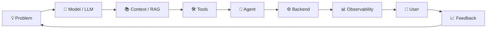

````html
<!-- =========================================================
     KHUNDRAKPAM BIKASH MEITEI — GITHUB PROFILE
     github.com/kh-bikash
========================================================= -->

<div align="center">


<br/>

<a href="https://github.com/kh-bikash">

</a>

<a href="https://github.com/kh-bikash?tab=followers">

</a>

<a href="mailto:khbikash17@gmail.com">

</a>

<a href="https://www.linkedin.com/in/bikash-kh-5544ba298/">

</a>

</div>

---

## `> whoami`

```js
const bikash = {
    name: "Khundrakpam Bikash Meitei",
    role: "AI Engineer",
    location: "India 🇮🇳",

    currentFocus: [
        "Agentic AI",
        "RAG Systems",
        "LLM Engineering",
        "AI Infrastructure",
        "Full-Stack AI Products",
        "3D + Interactive Systems"
    ],

    philosophy: "Build things that visibly do something.",

    currently: {
        building: "AI systems that survive outside localhost",
        learning: "better agents, better evals, better systems",
        shipping: true
    }
};
````

<div align="center">


</div>

---

# 🧠 What I Build

<table>
<tr>
<td width="50%">

### 🤖 AI Agents

Systems that can reason, call tools, use context and complete multi-step work.

`LangChain` `LangGraph` `LLMs` `RAG`

</td>
<td width="50%">

### ⚙️ AI Infrastructure

APIs, workers, queues, databases and deployment around models.

`FastAPI` `PostgreSQL` `Redis` `Docker`

</td>
</tr>

<tr>
<td width="50%">

### 🧬 ML Systems

Training, evaluation, inference and experimentation pipelines.

`PyTorch` `TensorFlow` `HuggingFace`

</td>

<td width="50%">

### 🌐 AI Products

I like AI more when users can actually interact with it.

`React` `Next.js` `Three.js` `TypeScript`

</td>
</tr>
</table>

---

# 🚀 Featured Systems

<div align="center">


</div>

<br/>

<table>
<tr>

<td width="50%" valign="top">

<h3 align="center">📻 README Radio</h3>

<div align="center">

<a href="https://github.com/kh-bikash/ReadmeRadio">

</a>

</div>

Turns a public GitHub repository into a narrated explainer video.

**Pipeline**

```text
Repository
   ↓
Code + README parsing
   ↓
LLM script generation
   ↓
Narration
   ↓
Audio alignment
   ↓
Remotion rendering
   ↓
Captioned MP4
```

`Node.js` `Python` `Remotion` `faster-whisper`

<div align="center">

[](https://github.com/kh-bikash/ReadmeRadio)
[](https://codespaces.new/kh-bikash/ReadmeRadio?quickstart=1)

</div>

</td>

<td width="50%" valign="top">

<h3 align="center">🌌 AIVerse</h3>

<div align="center">

<a href="https://github.com/kh-bikash/Aiverse">

</a>

</div>

An interactive AI laboratory where neural networks, attention and vision can be explored visually instead of only through text.

**Idea**

```text
Read AI ❌
Watch AI ⚠️
Interact with AI ✅
```

`React` `Three.js` `D3` `Transformers`

<div align="center">

[](https://github.com/kh-bikash/Aiverse)
[](https://codespaces.new/kh-bikash/Aiverse?quickstart=1)

</div>

</td>

</tr>

<tr>

<td width="50%" valign="top">

<h3 align="center">🚀 LaunchPad</h3>

<div align="center">

<a href="https://github.com/kh-bikash/launchpad">

</a>

</div>

Launch operations without fake dashboards.

Real owners.
Real deadlines.
Persistent state.
Computed readiness.

`Next.js` `Cloudflare D1` `Drizzle`

<div align="center">

[](https://github.com/kh-bikash/launchpad)
[](https://github.com/kh-bikash/launchpad#watch-the-real-product-walkthrough)

</div>

</td>

<td width="50%" valign="top">

<h3 align="center">🎓 Nova University ERP</h3>

<div align="center">

<a href="https://github.com/kh-bikash/nova-university-erp">

</a>

</div>

A deployed university management platform combining:

```text
Students   ─┐
Faculty    ─┤
Admin      ─┼──► One ERP
Library    ─┤
Transport  ─┤
Hostel     ─┘
```

`Next.js` `PostgreSQL` `Redis` `JWT`

<div align="center">

[](https://github.com/kh-bikash/nova-university-erp)
[](https://nova-university-erp.vercel.app/)

</div>

</td>

</tr>
</table>

---

# 🧪 More Experiments

<div align="center">

| Project                                                                          | What I was trying to build                        |
| -------------------------------------------------------------------------------- | ------------------------------------------------- |
| 🩻 [**MedVision**](https://github.com/kh-bikash/medvision)                       | Vision pipeline → generated 3D meshes → browser   |
| 🎨 [**Cosmic Comic Studio**](https://github.com/kh-bikash/comic-studio)          | Concurrent AI comic-panel generation + PDF export |
| 🧊 [**AlgoGenesis 3D**](https://github.com/kh-bikash/algogenesis-3d)             | Interactive 3D algorithm visualization            |
| 🤟 [**Sign Language Detector**](https://github.com/kh-bikash/sign_lang_detector) | Real-time CNN gesture inference through webcam    |

</div>

---

# ⚡ Tech Arsenal

<div align="center">

### Languages


### AI / ML


<br/><br/>


### Backend


### Frontend


### Infrastructure


### Tools


</div>

---

# 🏗️ How I Think About AI Systems



<div align="center">

> ### A good model is useful.
>
> ### A good system around the model is what makes it a product.

</div>

---

# 🧩 My Build Loop

```text
                     ┌───────────────┐
                     │     IDEA      │
                     └───────┬───────┘
                             ↓
                     ┌───────────────┐
                     │  BUILD FAST   │
                     └───────┬───────┘
                             ↓
                     ┌───────────────┐
                     │ BREAK THINGS  │
                     └───────┬───────┘
                             ↓
                     ┌───────────────┐
                     │ READ THE LOGS │
                     └───────┬───────┘
                             ↓
                     ┌───────────────┐
                     │ FIX THE REAL  │
                     │    PROBLEM    │
                     └───────┬───────┘
                             ↓
                     ┌───────────────┐
                     │     SHIP      │
                     └───────┬───────┘
                             │
                             └────────────↺
```

---

# 🧠 Current Operating Principles

<div align="center">


</div>

---

# 📊 GitHub Transmission

<div align="center">


<br/>


</div>

---

# 🏆 GitHub Trophies

<div align="center">


</div>

---

# 📈 Contribution Signal

<div align="center">


</div>

---

# 🐍 Feeding on Contributions

<div align="center">

<picture>
  <source media="(prefers-color-scheme: dark)" srcset="https://raw.githubusercontent.com/kh-bikash/kh-bikash/output/github-contribution-grid-snake-dark.svg">
  <source media="(prefers-color-scheme: light)" srcset="https://raw.githubusercontent.com/kh-bikash/kh-bikash/output/github-contribution-grid-snake.svg">
  
</picture>

</div>

---

# 🛰️ System Status

```yaml
developer:
  name: Khundrakpam Bikash Meitei
  github: kh-bikash

systems:
  agents:      ONLINE
  llms:        ONLINE
  rag:         ONLINE
  backend:     ONLINE
  docker:      ONLINE
  curiosity:   OVERCLOCKED

mission:
  - build
  - understand
  - deploy
  - repeat

status: "probably debugging something"
```

---

# 🎧 While Building

<div align="center">

<a href="https://spotify-github-profile.kittinanx.com/api/view?uid=YOUR_SPOTIFY_ID&redirect=true">

</a>

</div>

<!--
Replace YOUR_SPOTIFY_ID above with your Spotify user ID.
Delete this section if you don't want Spotify on your profile.
-->

---

# 💬 Let's Build Something

<div align="center">


<br/>

<a href="mailto:khbikash17@gmail.com">

</a>

<a href="https://www.linkedin.com/in/bikash-kh-5544ba298/">

</a>

<a href="https://github.com/kh-bikash">

</a>

<br/><br/>

```text
┌──────────────────────────────────────────────────────────────┐
│                                                              │
│       Build things that work outside the screenshot.         │
│                                                              │
│                   github.com/kh-bikash                       │
│                                                              │
└──────────────────────────────────────────────────────────────┘
```


</div>
```
