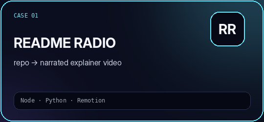
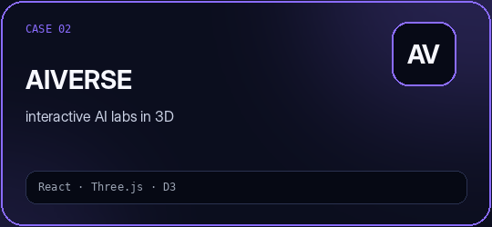
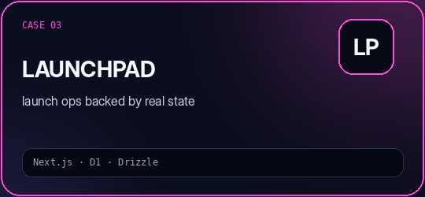
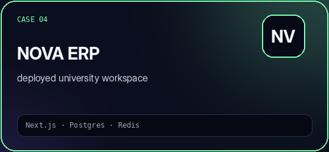
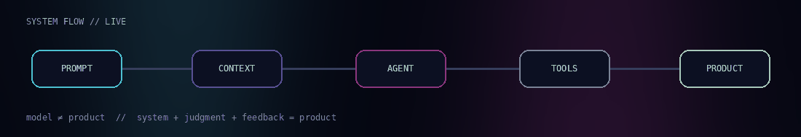
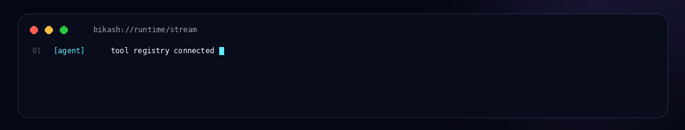

<!--
  BIKASH // AURORA OS
  A custom profile README with local animation assets.
  Put this README.md at the root of your kh-bikash/kh-bikash repository.
  Keep the assets/ folder beside it.
-->

<p align="center">
  
</p>

<p align="center">
  <a href="mailto:khbikash17@gmail.com"></a>
  <a href="https://www.linkedin.com/in/khundrakpam-bikash"></a>
  <a href="https://github.com/kh-bikash"></a>
</p>

<p align="center">
  <code>AI ENGINEER</code>&nbsp;&nbsp;•&nbsp;&nbsp;
  <code>AGENTIC SYSTEMS</code>&nbsp;&nbsp;•&nbsp;&nbsp;
  <code>RAG</code>&nbsp;&nbsp;•&nbsp;&nbsp;
  <code>LLM ENGINEERING</code>&nbsp;&nbsp;•&nbsp;&nbsp;
  <code>FULL-STACK AI</code>
</p>

<p align="center">
  
</p>

<br/>

<table>
<tr>
<td width="58%" valign="top">

## `◢ HELLO / 001`

I’m **Khundrakpam Bikash Meitei**.

I like AI when it stops being a chat box and starts becoming a **system** — something that can retrieve context, call tools, run jobs, keep state, recover from failures and give a user a result they can actually use.

My work usually lives somewhere between:

`model` → `agent` → `backend` → `product`

**Current obsession:** making complex AI systems feel simple from the outside.

</td>

<td width="42%" valign="top">

## `◢ STATUS / LIVE`

```yaml
runtime:
  agents: online
  retrieval: warm
  workers: healthy
  containers: running

focus:
  - agentic AI
  - RAG systems
  - AI infrastructure
  - interactive products

mode: ship > screenshot
```

</td>
</tr>
</table>

<p align="center">
  
</p>

# `◢ SELECTED WORK / 002`

<table>
<tr>
<td width="50%" align="center" valign="top">
<a href="https://github.com/kh-bikash/ReadmeRadio">
  
</a>
<br/>
<a href="https://github.com/kh-bikash/ReadmeRadio"><b>source ↗</b></a>
&nbsp;·&nbsp;
<a href="https://codespaces.new/kh-bikash/ReadmeRadio?quickstart=1">run ↗</a>
</td>

<td width="50%" align="center" valign="top">
<a href="https://github.com/kh-bikash/Aiverse">
  
</a>
<br/>
<a href="https://github.com/kh-bikash/Aiverse"><b>source ↗</b></a>
&nbsp;·&nbsp;
<a href="https://codespaces.new/kh-bikash/Aiverse?quickstart=1">open lab ↗</a>
</td>
</tr>

<tr>
<td width="50%" align="center" valign="top">
<a href="https://github.com/kh-bikash/launchpad">
  
</a>
<br/>
<a href="https://github.com/kh-bikash/launchpad"><b>source ↗</b></a>
&nbsp;·&nbsp;
<a href="https://github.com/kh-bikash/launchpad#watch-the-real-product-walkthrough">walkthrough ↗</a>
</td>

<td width="50%" align="center" valign="top">
<a href="https://github.com/kh-bikash/nova-university-erp">
  
</a>
<br/>
<a href="https://github.com/kh-bikash/nova-university-erp"><b>source ↗</b></a>
&nbsp;·&nbsp;
<a href="https://nova-university-erp.vercel.app/">live ↗</a>
</td>
</tr>
</table>

<br/>

<p align="center">
  
</p>

# `◢ HOW I THINK / 003`

<table>
<tr>
<td width="33%" valign="top">

### `01 — PROVE`

Start with the smallest version that proves the idea is worth continuing.

</td>
<td width="33%" valign="top">

### `02 — INSPECT`

Read the logs. Try ugly inputs. Break the happy path on purpose.

</td>
<td width="33%" valign="top">

### `03 — SHIP`

A deployed useful system beats a beautiful architecture diagram.

</td>
</tr>
</table>

> **The model is only one component.** Context, tools, state, observability, evaluation and judgment are what turn it into a product.

<p align="center">
  
</p>

# `◢ TOOLCHAIN / 004`

<p align="center">
  
</p>

<p align="center">
  <code>LangChain</code>&nbsp;
  <code>LangGraph</code>&nbsp;
  <code>HuggingFace</code>&nbsp;
  <code>RAG</code>&nbsp;
  <code>Embeddings</code>&nbsp;
  <code>Tool Calling</code>&nbsp;
  <code>Structured Outputs</code>&nbsp;
  <code>MLflow</code>
</p>

<p align="center">
  
</p>

# `◢ SIDE QUESTS / 005`

<table>
<tr>
<td width="25%" valign="top">

### `MEDVISION`
Vision pipeline → generated 3D meshes → browser.

[open ↗](https://github.com/kh-bikash/medvision)

</td>
<td width="25%" valign="top">

### `COMIC STUDIO`
Concurrent AI panel generation with styles + PDF export.

[open ↗](https://github.com/kh-bikash/comic-studio)

</td>
<td width="25%" valign="top">

### `ALGOGENESIS`
Step-through algorithm playback inside a 3D environment.

[open ↗](https://github.com/kh-bikash/algogenesis-3d)

</td>
<td width="25%" valign="top">

### `SIGN DETECTOR`
Real-time CNN gesture inference from webcam input.

[open ↗](https://github.com/kh-bikash/sign_lang_detector)

</td>
</tr>
</table>

<p align="center">
  
</p>

# `◢ MANIFESTO / 006`

```text
01  build the real flow, not the screenshot
02  logs usually tell the truth
03  measure before claiming
04  make failure visible
05  keep the user closer than the model
06  ship the smallest version that proves something
07  if it is featured here, the code should be real
```

<p align="center">
  
</p>

<br/>

<div align="center">

### `OPEN CHANNEL`

**Have an idea that sounds slightly too ambitious? Good.**

<a href="mailto:khbikash17@gmail.com"></a>
&nbsp;
<a href="https://www.linkedin.com/in/khundrakpam-bikash"></a>
&nbsp;
<a href="https://github.com/kh-bikash/kh-bikash/issues/new?title=Build%20idea%3A%20"></a>

<br/><br/>

<sub>built with curiosity · maintained with logs · shipped from India</sub>

</div>
